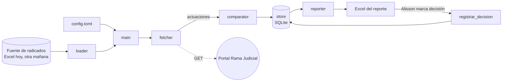

# Arquitectura

Pipeline lineal. Cada módulo tiene una responsabilidad y se prueba solo.

## Un ciclo

1. [[main]] abre el ciclo y lee las decisiones de Alisson del Excel anterior.
2. [[loader]] entrega la lista de radicados.
3. [[fetcher]] consulta cada radicado, sin repetir los ya consultados en este ciclo.
4. [[comparator]] clasifica: POSIBLE NOVEDAD, SIN CAMBIO o NO VERIFICADO.
5. Si falla más del porcentaje configurado, el ciclo se detiene y avisa (R5).
6. [[reporter]] escribe el reporte y manda el aviso a Alisson, con copia a Juan Uribe.

## Ejecución

`python -m consultor run`, lanzado por el Programador de tareas de Windows en la máquina virtual corporativa.

Ver [[Decisiones]] para el porqué de cada elección.
